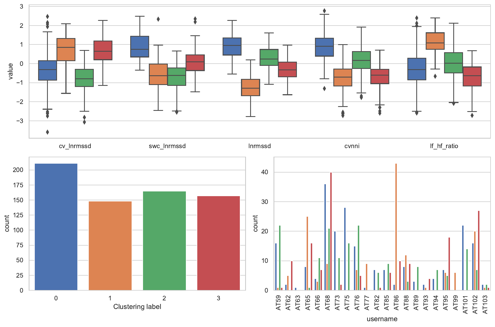
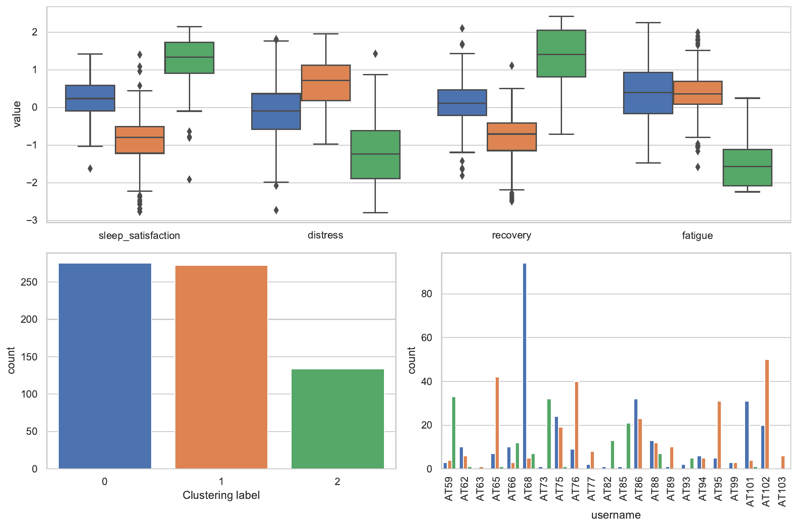
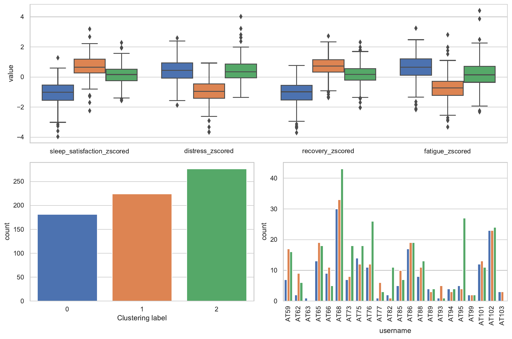

# atope-breast-clustering-analysis
A clustering analysis of the ATOPE+Breast Dataset (https://github.com/salvador-moreno/ATOPE-Breast)

## Layered clustering
---
The main results of this analysis are the different layers in which the variables are grouped: HRV, wellness, and normalized wellness. HRV is helpful to assess the physiological status of the patient, how well is she coping with training. 

### HRV
---

### Wellness
---
Wellness and normalized wellness may serve to develop improved adherence strategies depending on their profile.

